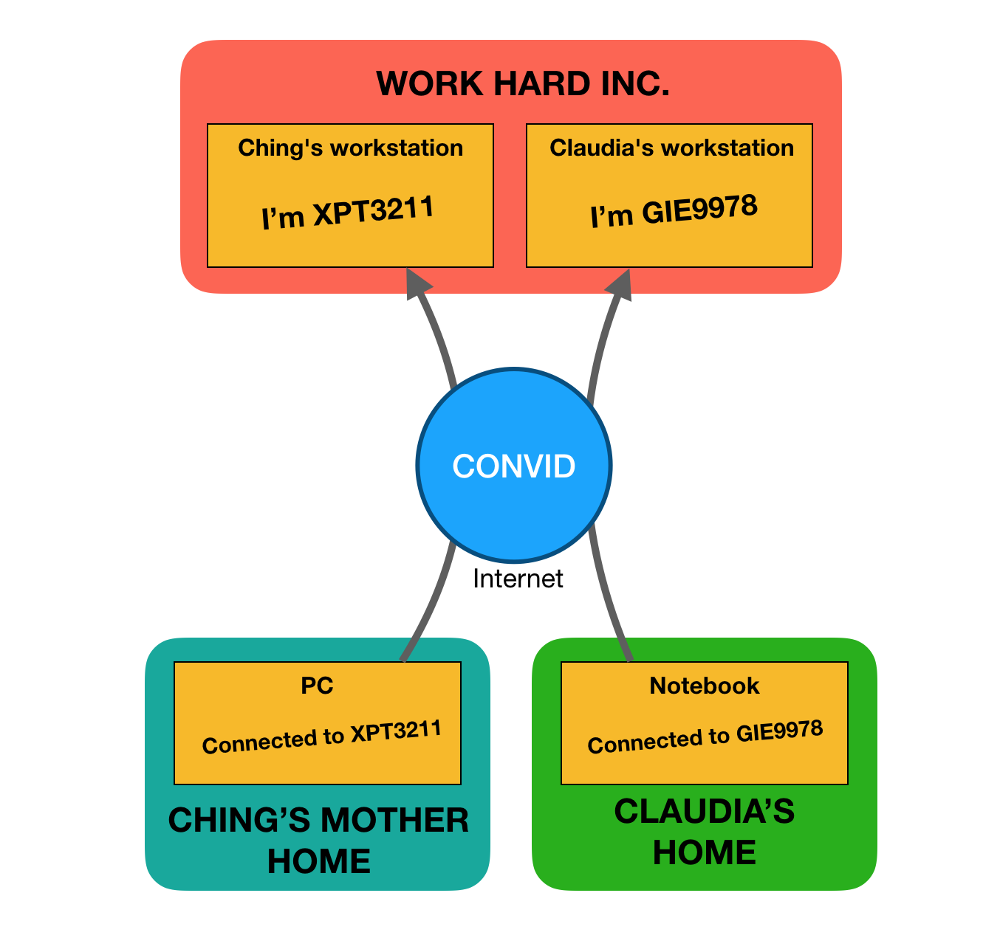
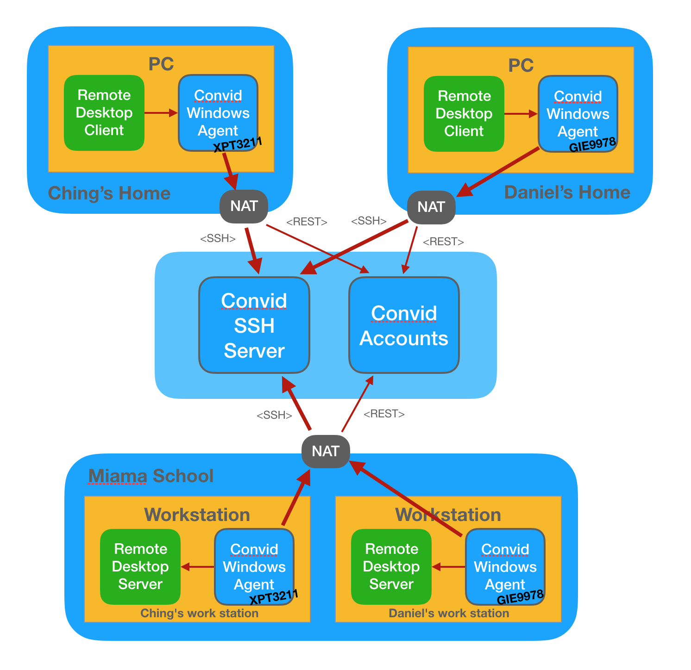

  

# Convid Remote Desktop Provider

Convid is a tool for enabling NAT'd clients to connect to NAT'd servers, initially designed for remote work using Remote Desktop.

## Microservices

* [Convid Accounts Frontend](https://github.com/labbsr0x/convid-accounts-frontend)
* [Convid Accounts Backend](https://github.com/labbsr0x/convid-accounts-backend)
* [Convid Windows Agent](https://github.com/labbsr0x/convid-agent-windows)
* [Convid SSH Server Bridge](https://github.com/labbsr0x/convid-ssh-server)

## Overall view

## Network communication

